# Feasibility of neutron–proton observables and spectral hardness with the BM@N Highly-Granular Neutron Detector

**Full-production truth study and reconstruction update**  
**BM@N HGND internal analysis note — not for external distribution**  
29 September 2026

## Abstract

Three SMASH Xe+Cs samples with symmetry-potential strengths
$U_{\mathrm{sym}}=0$, 18, and 90 MeV provide 2,345,993 events in 568
independent generation jobs. This note begins from the observable question.
The integrated neutron-to-proton yield ratio has differential kinematic
structure, but it is effectively insensitive to $U_{\mathrm{sym}}$ in the
exact HGND front-face acceptance. Spectral hardness is different: neutron
hardness rises by $4.52\%$ and proton hardness falls by $5.39\%$ between 0
and 90 MeV, giving a $10.48\%$ truth-level double-ratio response. These
conclusions use impact-parameter reweighting and a bootstrap over production
jobs.

The reconstructed observable must be defined inside the detector-efficiency
plateau. With one frozen GNN and the same score threshold for all three SMASH
samples, neither the raw neutron-candidate yield nor the detector-safe neutron
hardness separates the 0 and 90 MeV samples significantly. A hybrid
reconstructed-neutron/truth-proton hardness reaches only $1.7\sigma$, compared
with $13.8\sigma$ for the ideal truth double ratio, and is a feasibility test
rather than a measurement. An event-level study quantifies the efficiency for
the first, second, and subsequent true-neutron clusters rather than quoting
only an inclusive average.

## Decision summary

| Question | Result | Analysis decision |
|---|---:|---|
| Integrated $n/p$ in HGND | $+0.06\%\pm0.28\%$ for 90/0 | Do not use as a symmetry-potential estimator. |
| Differential $n/p(E_{\mathrm{kin}},y,p_T)$ | Strong shape dependence | Retain as a transport-model and phase-space diagnostic. |
| Neutron hardness in HGND | $+4.52\%\pm0.45\%$ | Primary detector-level physics target. |
| Proton hardness in the same window | $-5.39\%\pm0.51\%$ | Requires the charged tracking arm, not HGND alone. |
| Hardness double ratio | $+10.48\%\pm0.76\%$ | Preferred truth-level isovector diagnostic. |
| Conventional reconstructed $R_n$ | Denominator below 1 GeV has $\sim2\%$ efficiency | Redefine the reconstructed window inside the efficiency plateau. |
| Detector-safe reconstructed $\widehat R_n$ | $-0.39\%\pm2.86\%$ for 90/0 | Current reconstruction is statistically compatible with no response. |
| Modified $1$--$2$ GeV upper-tail hardness | $+1.49\%\pm1.39\%$ for 90/0 | Best ordered in-band ratio, but exploratory and only $1.07\sigma$. |
| Optimised truth window $(R_{\mathrm{thr}},\delta)$ | $+4.45\%\pm0.94\%$ held out | Broad optimum near 2.2 GeV; agrees with the conventional window. |
| Optimised reconstructed window | 0 of 60 admissible windows order | No window in the plateau separates the samples with this checkpoint. |

## Neutron-to-proton ratio feasibility

### The spectra behind the ratios

Every ratio in this note is formed from two nucleon spectra, and those spectra
are shown first so that a reader can see which part of the energy range carries
the response. Figure 0 gives the primary neutron and proton spectra inside the
exact front-face acceptance, each normalised per generation job before
averaging so that a job contributing more nucleons does not weight the shape.
Uncertainties resample production jobs.

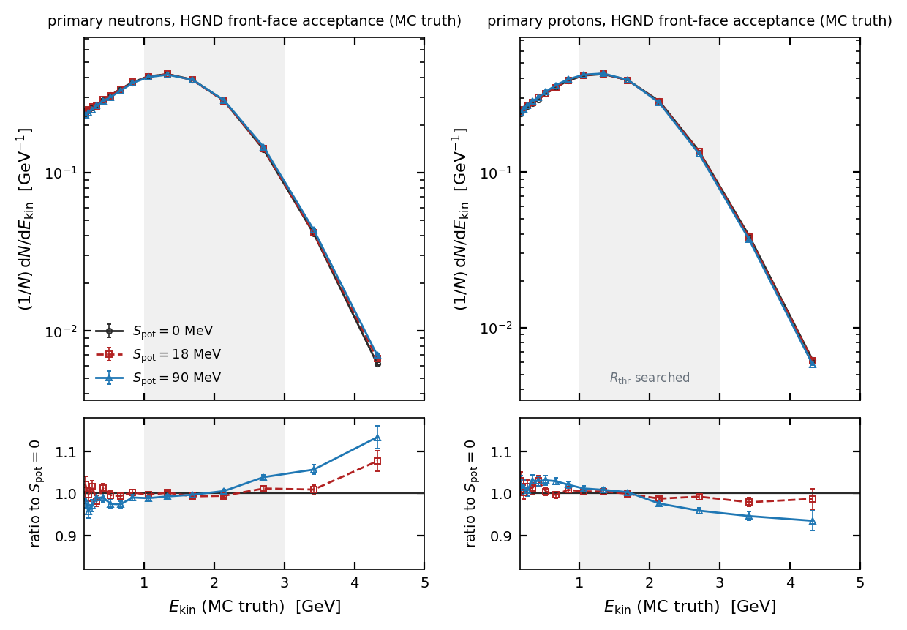

*Figure 0. Primary neutrons (left) and protons (right) inside the front-face
acceptance, for the three symmetry-potential samples, with the ratio to
$U_{\mathrm{sym}}=0$ below each panel and shared ratio limits. Bins with fewer
than 500 entries in the reference sample are suppressed. Job-level bootstrap,
400 resamples.*

The isovector structure is visible directly rather than only through an
integrated number. Above roughly 2 GeV the neutron ratio rises to about 1.15
while the proton ratio falls to about 0.93; below 0.1 GeV both rise. The
hardness ratios quoted later are integrals over these two opposite trends, and
the double ratio is large because the two species move apart rather than because
either moves far on its own.

### Global phase space

The global primary-nucleon ratio reproduces the qualitative structure of the
“n/p–SMASH check” reference: $n/p$ separates most strongly at high kinetic
energy and its shape depends on rapidity. Figure 1 uses the complete available
production rather than a file subset. The lower panels show the ratio to the
$U_{\mathrm{sym}}=0$ sample so that the parameter response is not confused
with the large common spectral shape.

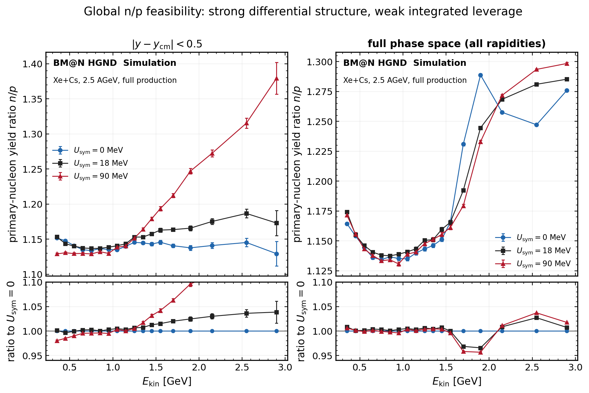

*Figure 1. Primary-nucleon $n/p$ versus kinetic energy at midrapidity (left)
and in full phase space (right). All available production files are included.
Statistical errors are evaluated with event clustering in the source
reduction.*

The earlier right-hand panel used the disjoint selection
$|y-y_{\mathrm{cm}}|>0.5$. Its two kinematic branches exchange dominance near
1.1 GeV, producing an abrupt, visually misleading structure. The revised
panel shows inclusive rapidity; all valid points are connected consistently in
the spectrum and ratio panels. The global differential separation is real but is not by itself an HGND
measurement. HGND covers a rectangular front face at negative $x$, only
0.0114 sr, and the SMASH reaction plane is fixed. A polar-angle-only selection
therefore cannot replace the exact $(x,y)$ acceptance.

### Exact HGND front-face acceptance

For a sample $s$, event weights $w_e$, a bin $B=[x_a,x_b)$ of width
$\Delta x_B=x_b-x_a$, and particle species $a\in\{n,p\}$, the differential
per-event yield used in this note is

$$
Y_a^{(s)}(B)\equiv
\left.\frac{dN_a}{dx}\right|_B
=\frac{\sum_e w_e\,N_{a,e}^{(s)}(B)}
       {\Delta x_B\sum_e w_e}.
$$

The differential neutron-to-proton yield ratio is

$$
\rho_{n/p}^{(s)}(B)\equiv
\frac{Y_n^{(s)}(B)}{Y_p^{(s)}(B)}
=\frac{\sum_e w_eN_{n,e}^{(s)}(B)}
       {\sum_e w_eN_{p,e}^{(s)}(B)},
$$

where the second equality is valid only when neutron and proton yields use the
same events, weights, bin and acceptance. An integrated yield is obtained by
replacing $B$ by the declared phase-space region and omitting $\Delta x_B$.
For any observable $O$, the quoted Spot response is
$\Delta_O^{90/0}=O^{(90)}/O^{(0)}-1$.

For selected reconstructed neutron candidates the corresponding raw yield is

$$
\widehat Y_n^{(s)}(B)=
\frac{\sum_c w_{e(c)}\,\mathbf{1}(q_c>q_0)\,
      \mathbf{1}(x_c^{\rm reco}\in B)}
     {\Delta x_B\sum_e w_e}.
$$

It includes fake candidates unless a response model is applied. The hybrid
$\widehat\rho_{n/p}=\widehat Y_n/Y_p^{\rm MC}$ therefore tests feasibility
with MC-truth protons; it is not a data-level $n/p$ measurement.

Figure 2 propagates both neutron and proton primaries from their production
vertices to the detector front face. The uncertainty is obtained by resampling
whole generation files; treating all particles as independent would
substantially underestimate it. The energy-differential ratio separates above
roughly 2 GeV, but its integral over the acceptance does not order the three
$U_{\mathrm{sym}}$ values. The integrated 90/0 change is only
$+0.06\%$ ($0.2\sigma$).

The apparent 2–3 GeV gap in the previous rendering was not physical. It came
from assigning logarithmic native bins to coarse bins by their centres. The
revised plot merges complete native intervals using their exact boundaries,
conserves all entries, and connects all populated points.

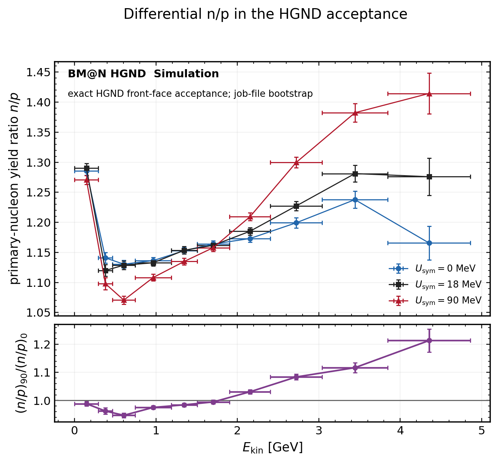

*Figure 2. Differential primary-nucleon $n/p$ in the exact HGND front-face
acceptance. The lower panel is the 90/0 double ratio. Error bars are from a
400-replica generation-job bootstrap.*

The conclusion is deliberately narrow: integrated $n/p$ is not a useful
$U_{\mathrm{sym}}$ observable for HGND. Differential $n/p$ remains valuable
for generator validation and for a combined neutron–charged-particle analysis
with matched phase space.

The angularly differential neutron yield and $n/p$ response provide a useful
cross-check because they retain information that cancels in the integral. In
the HGND angular band, however, the truth neutron-yield response is only
$+0.181\%\pm0.153\%$ ($1.18\sigma$). The much larger changes below about
$6^\circ$ are outside the HGND band and cannot be claimed as HGND sensitivity.

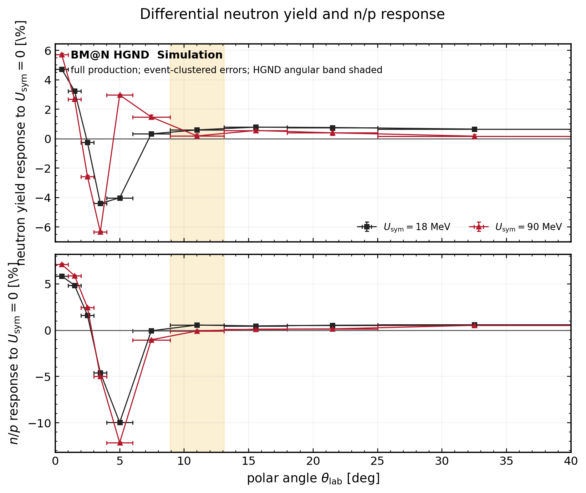

*Differential-yield diagnostic. Relative per-event neutron yield (top) and
$n/p$ response (bottom); the HGND angular band is shaded. Errors are
event-clustered.*

## Spectral hardness is the recommended observable

For the truth study we retain

$$
R=\frac{N(E_{\mathrm{kin}}>2\,\mathrm{GeV})}
        {N(E_{\mathrm{kin}}<1\,\mathrm{GeV})}.
$$

It removes the overall yield normalisation and tests the energy redistribution
that the symmetry potential produces. The 18 MeV point lies between the two
outer samples for $R_n$, $R_p$, and $R_n/R_p$.

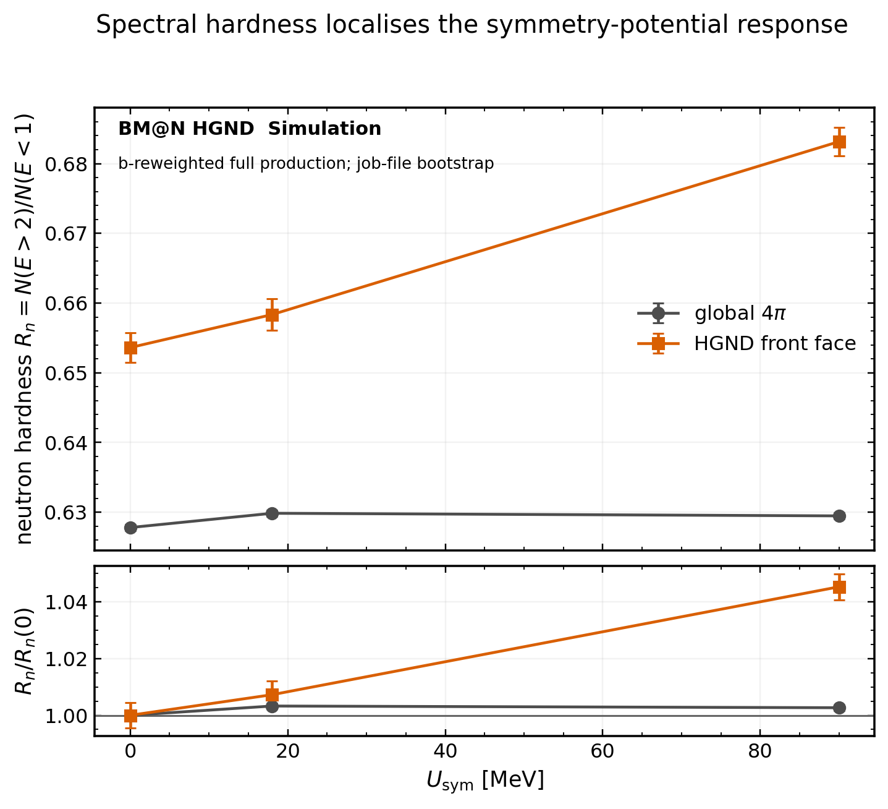

*Figure 3. Neutron spectral hardness globally and in the HGND front-face
acceptance. The response is localised in the forward detector window; the
global spectrum changes little.*

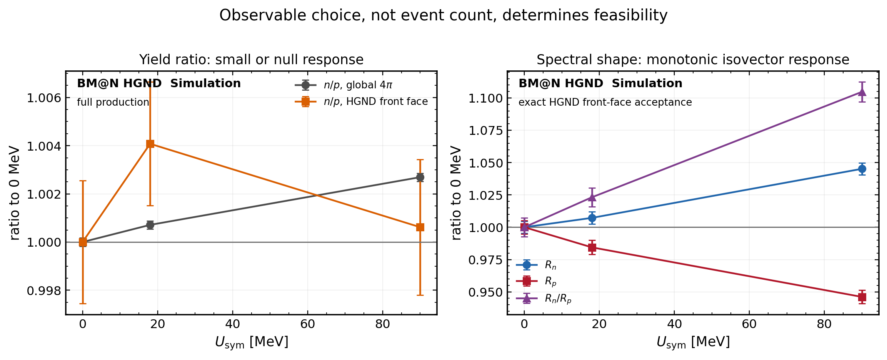

*Figure 4. Observable comparison. Yield $n/p$ is small or null in the HGND
acceptance, while the spectral-hardness observables show a monotonic isovector
response.*

At full statistics the exact-acceptance responses are

$$
\begin{aligned}
R_n(90)/R_n(0)-1 &= +4.52\%\pm0.45\%,\\
R_p(90)/R_p(0)-1 &= -5.39\%\pm0.51\%,\\
\frac{(R_n/R_p)_{90}}{(R_n/R_p)_0}-1 &= +10.48\%\pm0.76\%.
\end{aligned}
$$

The larger angular band gives $+10.73\%$ for the last quantity. The agreement
shows that the response is not created by the fiducial definition; the exact
acceptance simply has 7.9 times fewer particles and hence larger uncertainty.

The double-ratio response is not caused solely by protons. In logarithmic
response, neutron hardening contributes
$\ln(1.0452)=0.0442$ and proton softening contributes
$-\ln(0.9461)=0.0554$: approximately 44% and 56% of the total, respectively.
The neutron spectra can look nearly coincident on a logarithmic yield plot
while their high/low integrals still differ at more than $10\sigma$ because the
full production sample makes a few-percent shape change statistically precise.

### Separation power and hybrid feasibility estimates

The table and Figure 5 compare the 90/0 response using
$|\Delta|/\sigma_\Delta$ as a common separation metric. Every reconstructed
entry is derived from the same frozen GNN, common feature scaler and common
selection $q>0.45$ on 409,600 represented events per Spot sample. The raw
candidate quantities include fake clusters; the matched yield is shown only
as a closure diagnostic.

Three additional reconstructed shape observables test whether the populated
1--2 GeV interval can provide a more precise hardness measurement:

$$
\begin{aligned}
R_{n,\mathrm{eq}}^{1-2}
 &=\frac{N(1.5\leq E_{\rm reco}<2.0)}
          {N(1.0\leq E_{\rm reco}<1.5)},\\
R_{n,\mathrm{tail}}^{1-2}
 &=\frac{N(1.8\leq E_{\rm reco}<2.0)}
          {N(1.0\leq E_{\rm reco}<1.8)},\\
\langle E\rangle_{1-2}
 &=\frac{\sum_c E_c^{\rm reco}\,
          \mathbf{1}(1.0\leq E_c^{\rm reco}<2.0)}
         {\sum_c\mathbf{1}(1.0\leq E_c^{\rm reco}<2.0)}.
\end{aligned}
$$

All sums use selected candidates with $q>0.45$. These are raw,
detector-folded quantities rather than efficiency-corrected spectra.

| Observable | 90/0 response | Separation | Interpretation |
|---|---:|---:|---|
| Truth differential neutron yield, $8.9^\circ<\theta<13.1^\circ$ | $+0.181\%\pm0.153\%$ | $1.18\sigma$ | Weak in HGND angular band |
| Truth yield $n/p$ | $+0.062\%\pm0.283\%$ | $0.22\sigma$ | Not sensitive |
| Truth $R_n$ | $+4.519\%\pm0.445\%$ | $10.15\sigma$ | Neutron contribution |
| Truth $R_p$ | $-5.391\%\pm0.515\%$ | $10.48\sigma$ | Proton contribution |
| Truth $R_n/R_p$ | $+10.475\%\pm0.758\%$ | $13.82\sigma$ | Ideal combined observable |
| Reco candidate yield $\widehat Y_n$ | $+0.418\%\pm0.467\%$ | $0.89\sigma$ | Raw selected clusters; includes fakes |
| Reco matched yield $\widehat Y_n^{\rm match}$ | $+0.905\%\pm0.511\%$ | $1.77\sigma$ | Truth-matched closure diagnostic |
| Reco $d\widehat N_n/dE$, 2.6--3.0 GeV | $+1.727\%\pm2.909\%$ | $0.59\sigma$ | Differential candidate yield |
| Reco safe-window $\widehat R_n$ | $-0.391\%\pm2.863\%$ | $0.14\sigma$ | 1.8--2.4 versus $\geq2.6$ GeV |
| Reco $R_{n,\mathrm{eq}}^{1-2}$ | $+1.088\%\pm1.284\%$ | $0.85\sigma$ | Equal-width bins; not 0/18/90 ordered |
| Reco $R_{n,\mathrm{tail}}^{1-2}$ | $+1.494\%\pm1.395\%$ | $1.07\sigma$ | Upper-tail ratio; 0/18/90 ordered |
| Reco $\langle E\rangle_{1-2}$ | $+0.043\%\pm0.106\%$ | $0.41\sigma$ | In-band mean; not ordered |
| Hybrid yield $\widehat Y_n/Y_p^{\rm MC}$ | $+0.149\%\pm0.492\%$ | $0.30\sigma$ | Provisional hybrid |
| Hybrid $\widehat R_n/R_p^{\rm MC}$ | $+5.285\%\pm3.080\%$ | $1.72\sigma$ | Provisional hybrid |

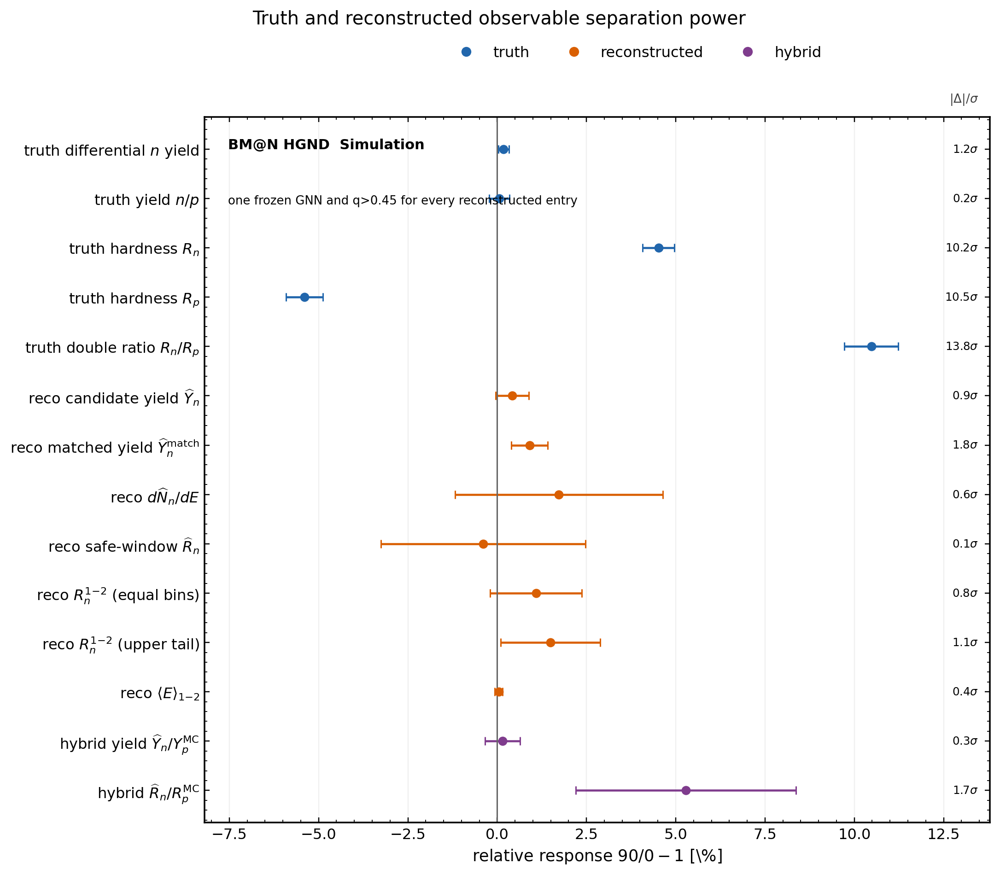

*Figure 5. Relative 90/0 response and separation power. Reconstruction
strongly reduces neutron-only sensitivity. All orange and purple points use
one frozen neutron model and one score threshold.*

The hybrid results establish feasibility, not final sensitivity. The current
neutron and proton products do not share an event-by-event sample, and the
quoted uncertainty assumes independent inputs. A publishable result requires
reconstructed charged tracks in the same front-face-equivalent phase space
and a common event/job bootstrap, including neutron–proton covariance. No
current reconstructed quantity reaches $2\sigma$; the apparent truth-level
advantage of hardness is not yet retained by reconstruction.

The 1--2 GeV ratios nevertheless improve the reconstructed statistical
precision. The equal-bin definition has a non-monotonic central sequence
$1.7279/1.7100/1.7467$ for 0/18/90 MeV. The upper-tail definition is ordered,
$0.3694/0.3707/0.3749$, but was selected after examining several boundaries;
its nominal $1.07\sigma$ separation is therefore descriptive rather than a
blind significance. It should be frozen on development data and evaluated on
an independent sample. A forward-folded binned shape fit over 1--2 GeV remains
preferable because it uses the full spectrum and explicitly models efficiency
and energy migration.

### SMASH reconstruction performance

The same model was evaluated on 1,831,257 SMASH cluster rows across the three
Spot samples. Its cluster-classification ROC AUC is 0.956. At the fixed
$q>0.45$ working point, count purity is 84.7% and count efficiency is 64.9%
(energy-weighted purity and efficiency are 86.4% and 72.0%). Energy resolution
improves from about 21% below 1 GeV to 9% near 3.75 GeV, but the median energy
response changes sign near 2 GeV and reaches a $-20\%$ bias at 2.8 GeV. This
compression explains why a truth threshold cannot simply be copied into
reconstructed energy.

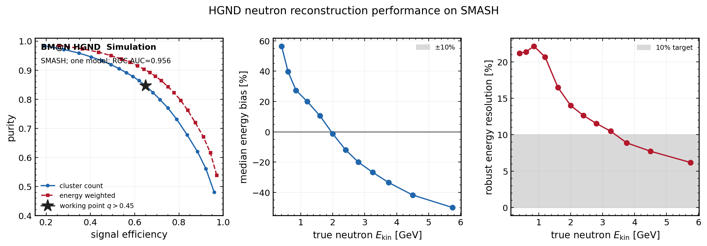

*SMASH reconstruction performance. Purity--efficiency, median energy bias and
robust energy resolution are shown for one model. The star marks the common
score working point used by all reconstructed observables in Figure 5.*

### Reconstructed neutron spectrum

Figure 8b gives the reconstructed side of the same picture: neutron candidates
above the purity-locked score threshold, binned in predicted energy.

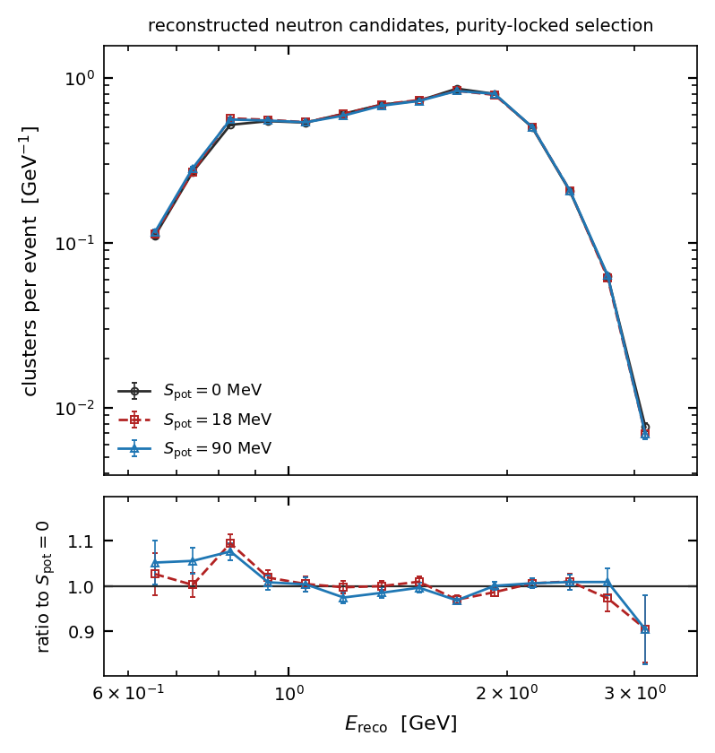

*Figure 8b. Reconstructed neutron candidates per event against predicted
energy, purity-locked selection, with the ratio to $U_{\mathrm{sym}}=0$ below.
Uncertainties are event-level rather than job-level: the source file list of the
v3 caches cannot be reconstructed, their graph counts exceeding the row space of
the directory they appear to derive from, so the generation-job label is not
available for these predictions. Bins with fewer than 300 reference entries are
suppressed.*

Two features matter for the observable definition. The reconstructed spectrum
is confined to roughly 0.4–4 GeV, far narrower than the truth spectrum, which
is the energy estimator's dynamic range rather than the physics. And the ratio
panel is flat within its errors across that whole range: the separation visible
in Figure 0 does not survive into the reconstructed spectrum with the current
frozen checkpoint.

### Centrality

The production has job-level impact-parameter block structure. The three full
samples nevertheless have compatible means,
$\Delta\langle b\rangle_{90-0}=+0.0034\pm0.0147$ fm. Event-level reweighting
reduces the residual spread in the three means to $9.5\times10^{-5}$ fm and
costs 0.1% in effective statistics. Figure 6 demonstrates that the isovector
response persists across centrality; the yield ratio does not provide a stable
alternative.

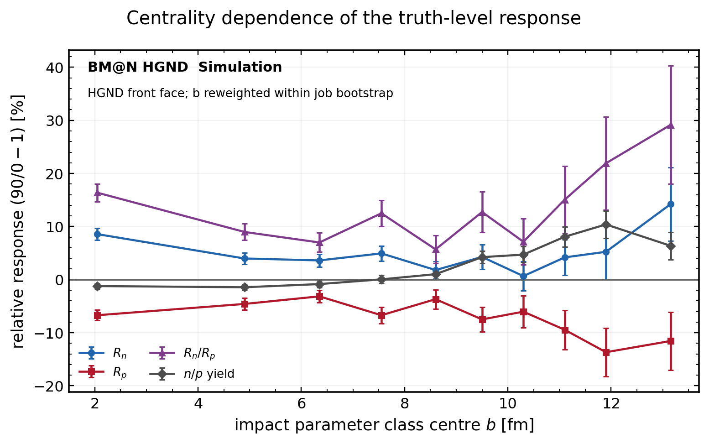

*Figure 6. Truth-level 90/0 response in ten impact-parameter classes after
reweighting. Every uncertainty is evaluated by resampling generation jobs and
rebuilding the weights in each replica.*

## Reconstruction efficiency and neutron multiplicity

An inclusive cluster efficiency is insufficient when the physics sample
contains two or more neutrons in the same event. The relevant questions are
conditional:

$$
\begin{aligned}
\varepsilon_k &\equiv
P(\text{$k$th-hardest true neutron selected}\mid N_n^{\mathrm{true}}\geq k),\\
C_k &\equiv
P(N_n^{\mathrm{selected,true}}\geq k\mid N_n^{\mathrm{true}}\geq k).
\end{aligned}
$$

Truth here means a truth-matched reconstructable neutron cluster
(`cl_label = 1`), and true neutrons are ranked by decreasing true kinetic
energy. A single classifier working point is applied to all three samples. The
resulting rank efficiencies and row-normalised multiplicity response are shown
in Figures 7 and 8.

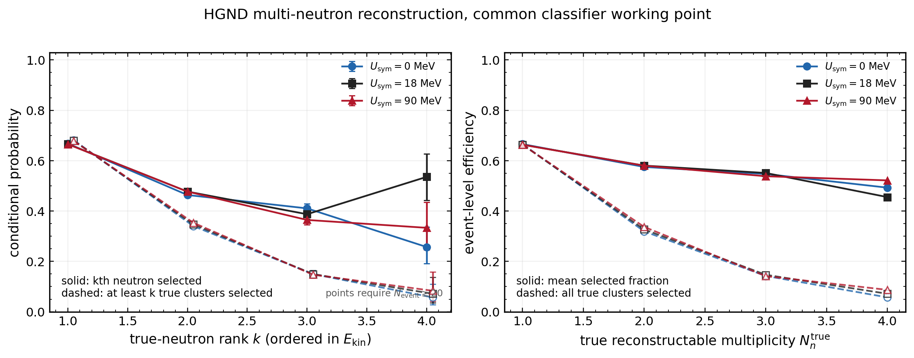

*Conditional efficiency of the first through fourth true-neutron clusters and
efficiency versus true event multiplicity. Wilson intervals are statistical
only. Points require at least 20 eligible events. The dashed curves require all
neutrons through rank $k$ to be retained and therefore expose compounding
losses in multi-neutron events.*

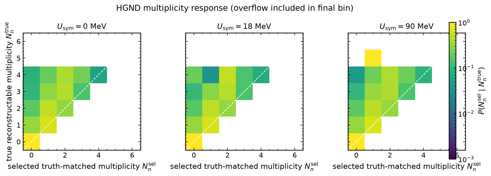

*Figure 8. Row-normalised response between reconstructable truth multiplicity
and selected truth-matched multiplicity. The last bin includes overflow. Fake
selected clusters are excluded here and are tracked separately through
purity.*

At the common score threshold 0.45, the first-neutron rank efficiency is
66.6–66.8% across the three Spot samples. Conditional on a second true neutron
it is 46.4–47.7%, and for a third it is 36.5–41.1%. The probability of retaining
all truth-matched neutrons is only 31.9–33.7% for true multiplicity two and
14.1–14.7% for multiplicity three. Fourth-neutron rank estimates are sample
limited (24–35 eligible events) and are not yet suitable for architecture ranking.
Within these uncertainties the three datasets are consistent for ranks 1--3;
this is a response-closure check, not proof of identical efficiencies. The
former 90 MeV point at rank 5 (the horizontal axis is neutron rank, not energy)
contained exactly one eligible event. It is retained in the CSV/JSON audit
products but omitted from the physics figure by the predeclared
$N_{\rm event}\geq20$ display requirement.

This decomposition should replace a single “neutron efficiency” number in
algorithm comparisons. The first-neutron efficiency mainly measures ordinary
acceptance and classification. The fall of $\varepsilon_k$ or $C_k$ with rank
isolates overlap, cluster merging, and low-energy losses. The same curves must
be shown for the baseline and every challenger architecture at a common purity
or with their full purity–efficiency envelopes.

These conditional probabilities are detector-response inputs, not candidate
Spot observables. Their purpose is to correct the neutron yield and energy
spectrum. In matrix form, the selected multiplicity/energy distribution is
$m_i=\sum_j A_{ij}t_j+b_i$, where $A_{ij}$ includes the rank-dependent losses
and migration and $b_i$ is the fake-cluster contribution. A forward-folded fit
of $t_j$, or a regularised inversion used only after closure tests, can recover
neutrons lost preferentially in multiplicity-two and multiplicity-three
events. This matters for Spot sensitivity even when the efficiency curves are
identical across samples: if Spot changes the joint energy–multiplicity
composition, applying only one inclusive efficiency biases both the corrected
yield and the high/low hardness ratio. The response therefore has to be binned
at least in true/reconstructed multiplicity and neutron energy, with its
uncertainty propagated through the 90/0 comparison.

## Energy response and observable definition

The efficiency for neutrons reaching the front face varies from 0.02 below
0.5 GeV and begins its rapid rise only around 0.5–0.7 GeV, reaching
approximately 0.80 around 2–3 GeV. The measured threshold ratio is therefore
not the truth ratio but

$$
R_{\mathrm{obs}}=
\frac{\int_H \epsilon(E)f(E)\,dE}{\int_L \epsilon(E)f(E)\,dE}.
$$

For $L:E_{\mathrm{kin}}<1$ GeV, the denominator is dominated by the accepted
0.7–1.0 GeV tail rather than by the full truth population. Direct inverse
efficiency weights reach roughly 50 below 0.5 GeV, creating extreme variance
and sensitivity to small modelling errors. Energy migration through the 1 GeV
boundary adds a second bias, and cancellation between Spot samples is
incomplete because their spectra are not identical where $\epsilon(E)$ is
steep. Thus the turn-on can attenuate, amplify, or even reverse the measured
90/0 response; it is not merely an overall loss of events.

Consequently, the denominator of the truth definition
$R=N(E_{\mathrm{kin}}>2\,\mathrm{GeV})/N(E_{\mathrm{kin}}<1\,\mathrm{GeV})$
is not robustly recoverable by bin-by-bin unfolding. The reconstructed
hardness observable must either use two energy regions inside the validated
efficiency plateau (the current held-out study uses 1.8–2.4 and $>2.6$ GeV) or
be extracted from a forward-folded spectral fit with efficiency, energy-scale,
and migration nuisance parameters. Thresholds are selected on training and
validation data only and frozen before the test sample is opened.

### The window as an optimisation rather than a choice

Both windows used so far were chosen by hand: $N(E>2)/N(E<1)$ inherited from
the truth study, then 1.8–2.4 against $>2.6$ GeV selected by inspection. Neither
is justified, and the first places its denominator where the detector records
two per cent of what arrives. The window is therefore now parametrised and
searched. With a centre $R_{\mathrm{thr}}$ and a half-gap $\delta$,

$$
\text{low}: E < R_{\mathrm{thr}}-\delta,
\qquad
\text{high}: E \ge R_{\mathrm{thr}}+\delta,
\qquad
R = N_{\text{high}}/N_{\text{low}},
$$

one parameter sets where the split sits and the other sets how much of the
migration-prone region around it is discarded. A larger $\delta$ buys immunity
to energy-scale and resolution error at the cost of statistics, which is a trade
the search should make rather than the analyst. A window is admissible only if
it keeps a minimum count in every sample, if it orders the three samples the way
the truth scan established, and — for reconstructed energy — if both edges lie
above the efficiency turn-on. The optimum is selected on development units and
one window is carried to the held-out units.

At truth level the optimum is broad, with the eight best windows spanning
$R_{\mathrm{thr}}=1.9$–$2.4$. The held-out result shows what hand-picking
conceals: the development estimate is $+6.73\%$ at $9.8\sigma$, and the same
window on held-out jobs gives $+4.45\%\pm0.94\%$ at $4.7\sigma$. That the
optimised window lands where the conventional one did, $+4.45\%$ against
$+4.52\%$, is reassurance about the conventional choice rather than a new
result.

At reconstructed level the search returns nothing. Of sixty admissible windows
inside the plateau, **none orders the three samples**. The strongest
positive-but-unordered window gives $+0.71\%$ at $0.44\sigma$. The optimiser
reports this rather than returning the best-looking row, because sorting by a
figure of merit that is zero everywhere would hand back an arbitrary window and
dress a null up as a measurement. This is a stronger statement than the earlier
single-window null: it is not that the chosen window failed, but that no window
in the validated region succeeds with this checkpoint.

The common feature normalisation is mandatory. Fitting a separate scaler in
each sample changed the scale of the time-of-flight energy feature by 1.9% and
removed part of the physical difference before inference. Reusing one scaler
reduced the differential high-energy response from $-30.7\pm8.6$ to
$-11.4\pm9.8$ MeV and restored the sign and ordering of the reconstructed
central values without changing the network weights.

## Algorithm comparison and release criteria

The paper-facing analysis should describe a frozen baseline and one or more
challenger architectures, not the chronological history of training. Every
model must use the same job-level train/calibration/test split, shared scaler,
truth definition, front-face selection, and pre-declared working points. The
minimum comparison is:

1. Cluster ROC and purity–efficiency curve.
2. Energy linearity and resolution versus true energy.
3. $\varepsilon_k$ and $C_k$ through at least the fourth neutron.
4. The complete multiplicity response matrix.
5. Reconstructed hardness on a blind, adequately powered test set.
6. Stability under seed, score-threshold, and energy-window variation.

A challenger passes the physics gate only if reconstructed and truth 90/0
effects have the same sign, their paired difference is below $2\sigma$ and
below 25% of the truth effect, the differential response is consistent with
zero, and the 0/18/90 ordering survives. If no architecture passes, the
measurement should use a forward-folded spectral fit with response nuisance
parameters instead of an unfolded threshold ratio.

## Current internal status and next actions

The resumable end-to-end CUDA training has a validated checkpoint after ten
epochs; the best validation loss is 0.7349 at epoch 9. The resume-state defect
that stopped the continuation was corrected and covered by a regression test,
and a test-partition resume completed successfully before the rocky job was
relaunched. These operational details belong in this update note and are not
paper content.

The remaining ordered work is:

1. Convert the DCM-QGSM-SMM Xe+CsI sample through the same path as a
   pipeline-health control. The benchmarks this note measures against — ROC AUC
   about 0.97, roughly 80% efficiency at 87% purity, linearity and resolution
   under 10% from 0.7 to 5 GeV — were established on that sample, so running it
   through this chain separates "the model is weaker on SMASH" from "something
   in this chain is wrong". The converter now searches six header names for the
   impact parameter and reports which one it found, since a generator that does
   not carry `DstEventHeader` would otherwise write $B=-1$ silently, as happened
   once already. `run_convert.sh --dataset dcm` carries the preset.
2. Train the challenger to the frozen stopping condition.
3. Evaluate all three samples and regenerate the multiplicity and response
   figures from that checkpoint.
4. Repeat the same plots for the baseline and at least one architecture
   challenger.
5. Re-run the window search on the retrained checkpoint. The current null is a
   statement about the frozen model, not about the observable.
6. Freeze the blind test before any reconstructed-sensitivity statement.
7. Move only the frozen baseline–challenger comparison into the paper.

## Reproducibility record

The truth reductions contain 195/200/173 generation files and
804,369/824,338/717,286 events for $U_{\mathrm{sym}}=0/18/90$ MeV. Plot
inputs and job-bootstrap products are stored under
`results/np_ratio_smash_check_full`, `results/acceptance_full`, and
`results/update_note`. The reconstructed comparison contains 409,600 represented
events per Spot sample and is recorded in
`results/update_note/smash_reconstructed_observables.json`. The figure builder is
`scripts/make_update_note_figures.py`; the multiplicity analysis is
`scripts/multiplicity_efficiency.py`. The nucleon and reconstructed spectra are
`scripts/make_spectra_figures.py`; the window search is
`scripts/hardness_threshold_opt.py`, whose full scan surfaces are stored in
`results/update_note/hardness_opt_truth.json` and
`results/update_note/hardness_opt_reco.json` so that the optimum can be checked
to be broad rather than a spike.
